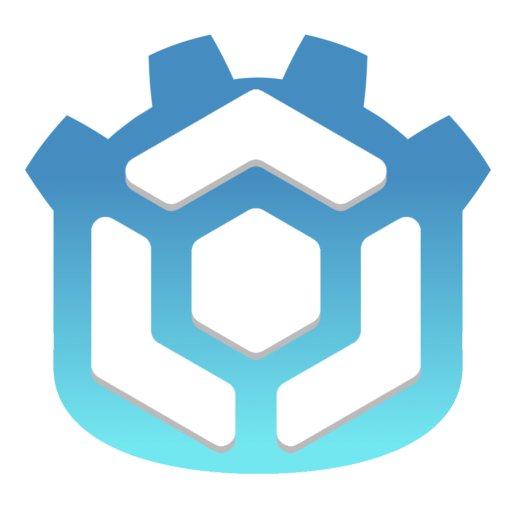
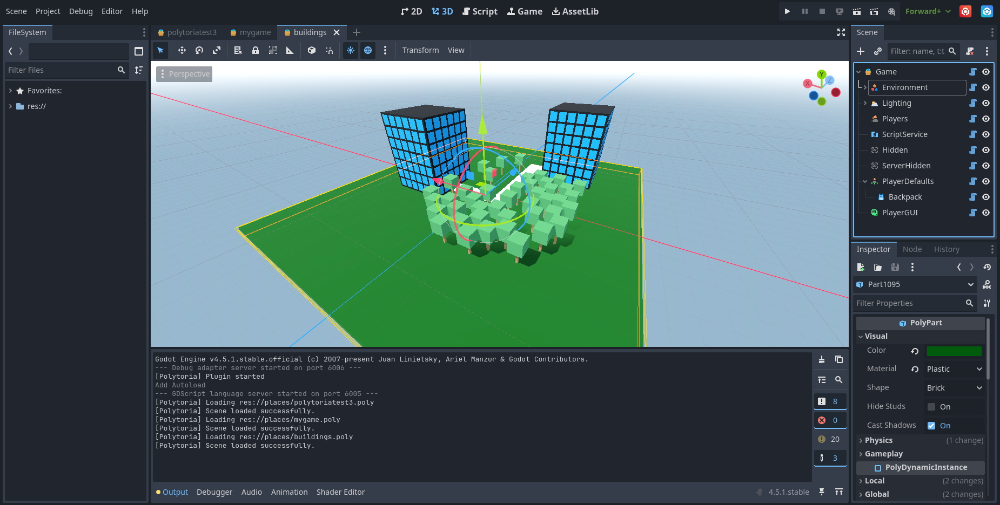

# Godotlytoria

Godotlytoria is a [Polytoria](https://polytoria.com) Place Creator and Editor in the form of a Godot plugin for the Godot Editor. It allows you to make and edit Polytoria games using Godot. 

## An alternative to the Creator.
The current Polytoria Creator is lacking in features, has a very displeasing UI, not modifiable and not very servicable for use for a serious game editor. I created Godotlytoria in a very short timespan, about 3 to 4 days in total, utilizing Godot as the perfect base for a place editor. However, I cannot guarantee that there will be no issues. If you would like to contribute or report bugs, please do so. 

## Usage
[Download Godotlytoria](https://github.com/s5lachlan/godotlytoria/archive/refs/heads/main.zip) and open it as a Godot Project.
### Opening a .poly file
There are a few ways of opening .poly files
- Select **Scene**, then *Open Scene*, then select your .poly file. 
- Double click the .poly file from the filesystem dock.
Depending on how large the file is, it may take a while to load. 
### Creating a .poly file
Create a new scene in Godot and set the root of the scene to "PolyGame", it will then generate you a basic template place. You may then save the scene as a .poly file.
### Running a .poly file
Press the red Polytoria button in the right hand corner of your screen. It will prompt you for a poly file to load, select it and it will run the client in solo mode with your .poly file. If nothing happens, check the settings to ensure that you have set the location of your Polytoria binaries, so Godotlytoria can run Polytoria.
### Scripting
LuaLS and .luarc.json are included in this repo, open am external editor for coding in Lua, such as Zed, and set the Script Path of scripts to your lua files. Godotlytoria will set the Source of the script objects to the contents of the file when the place is saved.

## Roadmap
- [x] Ability to open the client and creator from Godot
- [x] Ability to load .poly files
- [x] Ability to save .poly files 
- [x] Ability to load .ptmd model files
- [ ] Ability to save models as .ptmd model files
- [x] Write Lua externally and connect to scripts via a file path.
- [ ] Ability to anchor-scale 3D parts in one direction on one axis, as you would in the editor.
- [ ] Brick materials and shapes visible in editor
- [ ] NPC model visible in editor
- [ ] Custom tools to make life easier, e.g a Tool Creator, templates for things
- [ ] Ability to code in GDScript and convert it to Lua 
- [ ] Implement Toolbox
- [ ] Implement fetching Polytoria asset IDs

Likely to not support the following (unless I figure the API out)
- Publishing directly to Polytoria

### API stuff I found
Calling them doesnt work due to 403 though. Damn.

- Store Listings: https://api.polytoria.com/v1/store/ID
- Meshes: https://api.polytoria.com/v1/assets/serve-mesh/ID
- Decals: https://api.polytoria.com/v1/assets/serve/ID/asset
- Audio: https://api.polytoria.com/v1/assets/serve-audio/ID
- Users: https://api.polytoria.com/v1/users/ID
- Find user: https://api.polytoria.com/v1/users/find?username=USERNAME
- Toolbox: https://api.polytoria.com/v1/models/toolbox?page=PAGE&q=SEARCHQUERY&cat=CATEGORY
- Models: https://api.polytoria.com/v1/models/get-model?id=ID

## Credits
GodotXML by elenakrittik. LuaLS files from GoldenretriverYT.

## Have fun!
